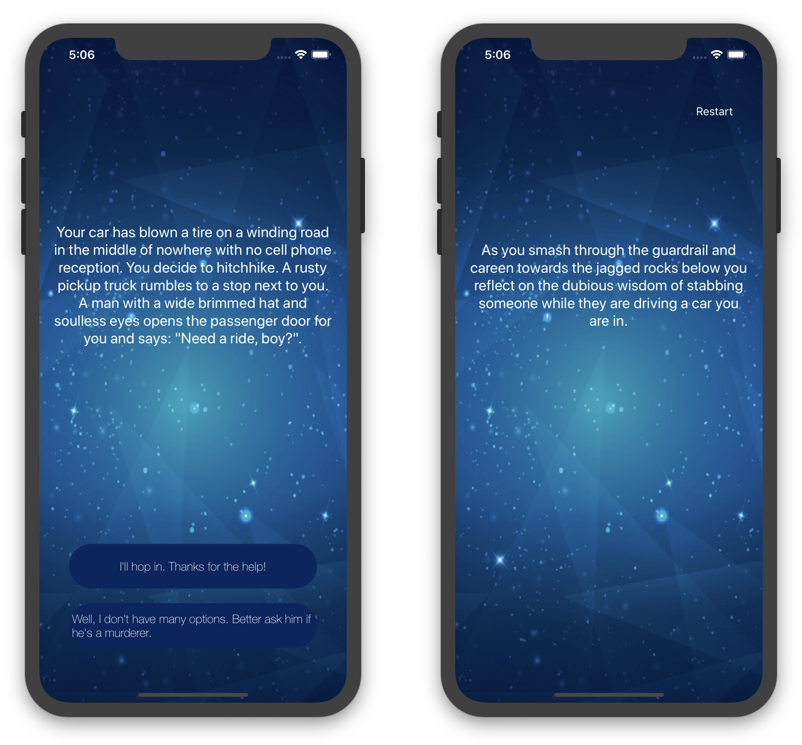

# Simple iOS App Named: *Destini*
This is *practise project* for iOS app development course.

__What I have learned here:__
1. Updating the *Views* according to state of app,
2. Logic to control the flow of the program.

In this app, I've created a “Choose Your Own Adventure” game similar to the App Store hit “Life Line” app. The app will tell a story depending on what the user chooses and can be fleshed out and modified to provide an engaging story-telling experience.

___
__Screenshot:__
